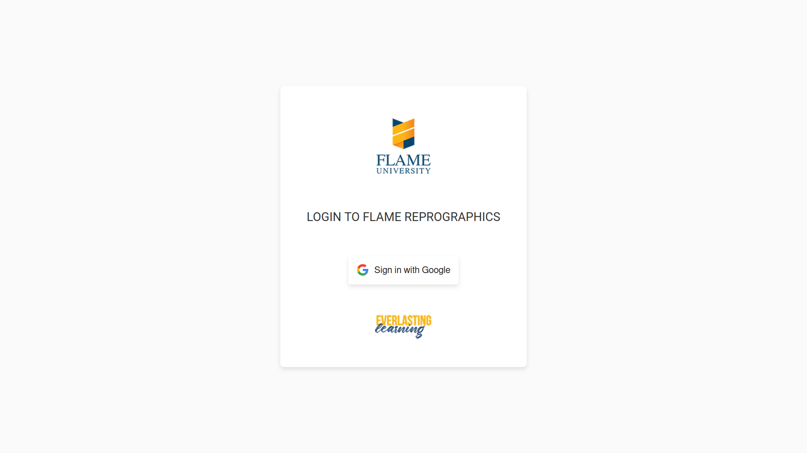
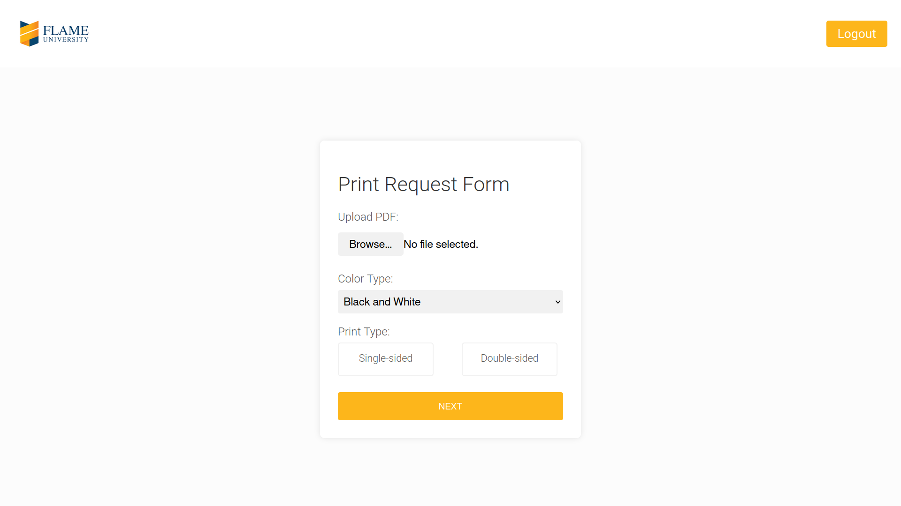
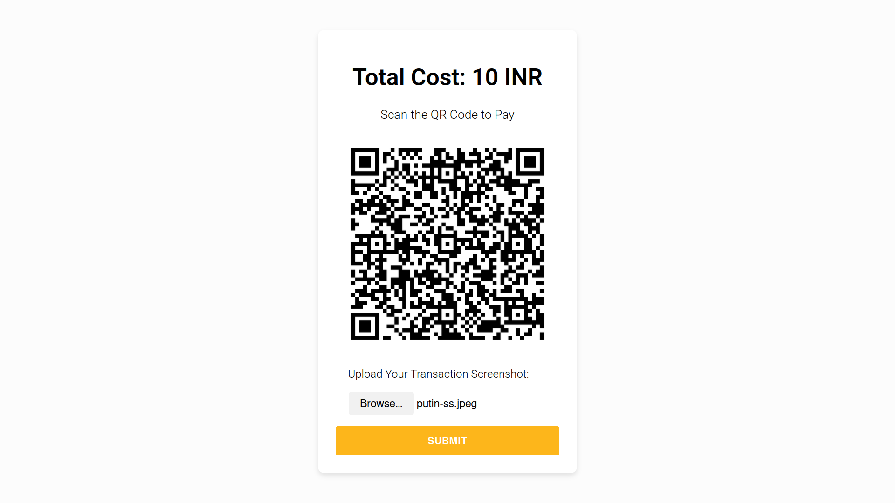
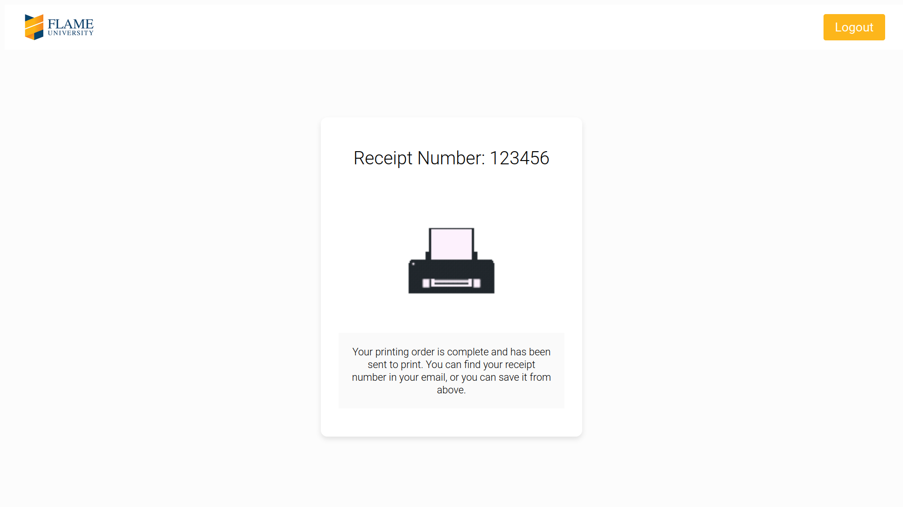
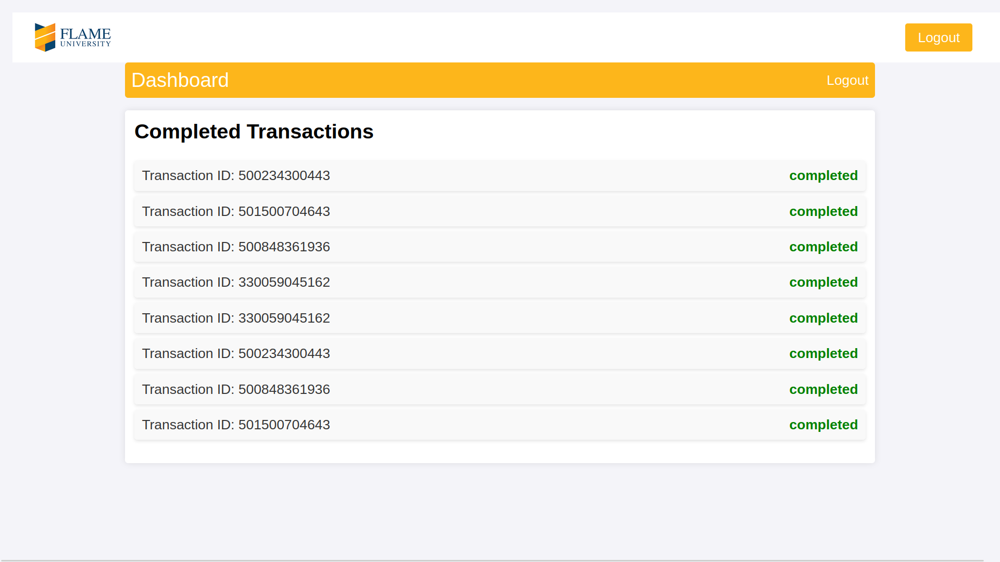

# Reprographics Automation System

This project automates the reprographics (printing) process using a web application built with Flask, MongoDB, and Google SSO. It allows users to submit print jobs, verify payments, and manage a print queue efficiently.

## Demo 

### Login Page

### PDF Upload Page

### Payment Page

### Summary Page

### Admin Dashboard Page


## Features
- **User Authentication**: Google SSO for secure login.
- **Print Job Submission**: Users can upload documents with details like the number of copies, black & white/color, and duplex printing.
- **Payment Verification**: Extracts receipt ID from the transaction screenshot using OpenCV and PyTesseract.
- **Queue System**: Documents are sent to a queue for manual verification and printing.
- **MongoDB Integration**: Stores user details, print job data, and transaction records.
- **Organized Data Management**: All submitted jobs and transactions are properly stored, reducing errors and improving efficiency.

## How This Project Improves the Current Printing Process
Before implementing this system, the reprographics process was manual, leading to inefficiencies and delays. Now:
- **Time Savings**: The new system saves 2-3 minutes per print job by automating payment verification and job submission.
- **Better Organization**: All print jobs and payment records are systematically stored, reducing errors and improving accountability.
- **Faster Verification**: Instead of manually checking receipts, OCR technology extracts transaction details automatically.

## Tech Stack
- **Backend**: Flask (Python)
- **Frontend**: JavaScript, HTML, CSS
- **Database**: MongoDB
- **OCR Processing**: OpenCV & PyTesseract
- **Authentication**: Google SSO

## Installation

### Prerequisites
- Python (>=3.8)
- MongoDB
- Google Cloud OAuth Credentials (for Google SSO)

### Steps
1. **Clone the Repository**
   ```sh
   git clone https://github.com/J11tendra/FLAME-Reprographics.git
   cd reprographics
   ```

2. **Set Up Virtual Environment**
   ```sh
   python -m venv venv
   source venv/bin/activate  # On Windows, use 'venv\Scripts\activate'
   ```

3. **Install Dependencies**
   ```sh
   pip install -r requirements.txt
   ```

4. **Configure Environment Variables**
   Create a `.env` file in the root directory and add:
   ```ini
   MONGO_URI=mongodb://localhost:27017/reprographics
   GOOGLE_CLIENT_ID=your-google-client-id
   GOOGLE_CLIENT_SECRET=your-google-client-secret
   FLASK_SECRET_KEY=your-secret-key
   ```

5. **Run the Application**
   ```sh
   flask run
   ```
   The app will be available at `http://127.0.0.1:5000/`.

## Usage
- **Login with Google** to access the portal.
- **Upload documents** and submit print jobs.
- **Verify payments** using transaction screenshots.
- **Admins approve** jobs from the queue and send them for printing.

## Demo Video
To better understand how the system works, watch the demo video below:

Link: https://drive.google.com/file/d/1LU1_ihK3KvxIj1UzAfuPLG3Ozp_OBxKv/view?usp=sharing

## Contributing
Feel free to fork the repository and submit pull requests.

## License
This project is licensed under the MIT License.